# 🛡️ Silent Risk

**Privacy-Preserving AI-Powered Risk Analysis for Web3**

A decentralized application that enables users to prove their on-chain risk credibility without revealing their wallet identity. Built with Zama FHE (Fully Homomorphic Encryption), Zero-Knowledge Proofs, and AI-powered strategy validation.

[](https://opensource.org/licenses/MIT)
[](https://soliditylang.org/)
[](https://www.python.org/)
[](https://nextjs.org/)

---

## 🎯 **What is Silent Risk?**

Silent Risk solves the **privacy problem in Web3**: **How can you prove credibility without revealing identity?**

### **💡 The Problem**

In the current Web3 ecosystem:
- **DAOs/Protocols** need to verify: "Is this wallet trustworthy? Low risk or high risk?"
- **Users** want to prove: "I'm a credible user with low risk"
- **But**: This proof process **completely exposes the original wallet address**
- **Result**: ❌ **Privacy lost, transaction history analyzed, identity tracked**

**Real-world Example:**
```
❌ Traditional Approach:
DAO: "Prove you're low risk?"
User: "Here's my wallet: 0xABCD..." 
DAO: *Analyzes entire transaction history, balance, protocols*
→ User loses all privacy!
```

### **✨ Silent Risk Solution**

**Privacy-Preserving Risk Passport** - An "anonymous credential system":

```
✅ Silent Risk Approach:
DAO: "Prove you're low risk?"
User: "Here's my Passport NFT (from anonymous Wallet B)" 
DAO: *Verifies on-chain: Risk band = LOW*
→ DAO knows user is low risk, does NOT know original wallet!
```

**4-Step Process:**

1️⃣ **Private Analysis** (Wallet A)
   - Worker analyzes original wallet **offline**, memory-only
   - Calculates risk score based on public on-chain data
   - No sensitive information stored

2️⃣ **Encrypted Storage** (RiskScoreVault)
   - Encrypts score using **Zama FHE** (Fully Homomorphic Encryption)
   - Stores **commitment** = hash(wallet, score, secret)
   - Secret known only to user, never stored on-chain

3️⃣ **ZK Proof Generation** (Browser)
   - User generates **ZK proof** in browser (local, private)
   - Proves "I know the secret for this commitment"
   - NEVER reveals: original wallet, secret, exact score

4️⃣ **Anonymous Passport** (Wallet B - anonymous)
   - Mints **Passport NFT** from new anonymous wallet (Wallet B)
   - DAO verifies risk level via NFT
   - **Zero linkage** between Wallet A and Wallet B

### **🔑 Technological Breakthroughs**

| Technology | Purpose | What It Protects |
|-----------|----------|------------|
| **🔐 FHE (Zama)** | Encrypts score, enables threshold queries without decryption | Exact risk score remains hidden |
| **🎭 ZK-SNARK** | Proves ownership without revealing information | Original wallet not revealed |
| **🎫 NFT Passport** | Verifiable anonymous credential | Identity unlinkable |
| **🤖 AI Strategy Validation** | Validates trading strategies with AI | Detects high risk before trading |

### **📊 Comparison with Traditional Solutions**

| Criteria | Traditional KYC/Analysis | Silent Risk |
|----------|-------------------------|-------------|
| **Privacy** | ❌ Identity fully exposed | ✅ 100% anonymous |
| **Verification** | ✅ Verifiable | ✅ On-chain verification |
| **Reusable** | ❌ Must re-verify each time | ✅ Passport reusable |
| **Trust** | ❌ Trust in KYC organization | ✅ Trust in smart contracts |
| **Cost** | 💰 High KYC fees | 💰 Low gas costs |

---

## 🏗️ **System Architecture Overview**

### **System Context Diagram**

The diagram below illustrates the complete Silent Risk ecosystem and how components interact:


### **Container Diagram - Component Details**


---

---

## 🔄 **Complete User Flow - Detailed Process**

```mermaid
sequenceDiagram
    autonumber
    participant User as 👤 User<br/>(Wallet A)
    participant UI as 🖥️ Frontend
    participant BE as ⚙️ Backend API
    participant Kafka as 📬 Kafka
    participant Worker as 🔧 Worker
    participant RPC as 🔗 Ethereum RPC
    participant Redis as 💾 Redis
    participant Vault as 🏦 RiskScoreVault
    participant Anon as 🎭 Anonymous<br/>(Wallet B)
    participant NFT as 🎫 PassportNFT
    participant DAO as 🏛️ DAO

    rect rgb(240, 240, 255)
        Note over User,Redis: Phase 1: Risk Analysis Request
        User->>UI: Login with Privy (X/Farcaster)
        UI->>User: Embedded wallet created
        User->>UI: Click "Analyze Wallet A"
        UI->>User: Request signature (EIP-191)
        User->>UI: Sign message
        Note right of UI: Message:<br/>"Silent Risk Analysis:<br/>0xABCD... at timestamp"
        UI->>BE: POST /risk/analyze<br/>{wallet, signature}
        BE->>BE: Verify signature (ecrecover)
        BE->>Redis: Check cache by wallet
        alt Cached (< 30 min)
            Redis-->>BE: Return cached result
            BE-->>UI: Return analysis (instant)
        else Not Cached
            BE->>Kafka: Publish task<br/>(wallet, task_id)
            BE-->>UI: 202 Accepted<br/>{task_id, status: pending}
            UI->>BE: Poll GET /risk/status/:task_id<br/>(every 3s)
        end
    end

    rect rgb(255, 245, 240)
        Note over Kafka,Vault: Phase 2: Worker Processing
        Kafka->>Worker: Consume task
        Worker->>Redis: Update status: processing (10%)
        Worker->>Worker: Wallet in MEMORY ONLY
        Worker->>RPC: eth_getBalance(wallet)
        Worker->>RPC: eth_getTransactionCount(wallet)
        Worker->>RPC: eth_getLogs (ERC20/721 transfers)
        Worker->>RPC: Binary search first TX
        RPC-->>Worker: On-chain data
        Worker->>Redis: Update progress (40%)
        Worker->>Worker: Calculate risk score<br/>(age, volume, diversity...)
        Worker->>Worker: Score = 2500 (LOW)
        Worker->>Redis: Update progress (60%)
        Worker->>Worker: Encrypt score (FHE)
        Worker->>Worker: Generate commitment<br/>= hash(wallet, encrypted, secret)
        Worker->>Redis: Update progress (80%)
        Worker->>Vault: submitRiskAnalysis()<br/>(commitment, encrypted_score)
        Vault-->>Worker: TX confirmed
        Worker->>Redis: Cache passport data<br/>{commitment, secret, nullifier}
        Worker->>Redis: Cache analysis result
        Worker->>Kafka: Publish result
        Worker->>Redis: Update status: completed (100%)
        Worker->>Worker: 🗑️ Clear wallet from memory
    end

    rect rgb(240, 255, 240)
        Note over UI,NFT: Phase 3: Passport Claiming
        UI->>BE: GET /risk/status/:task_id
        BE->>Redis: Retrieve result
        Redis-->>BE: {status: completed, result}
        BE-->>UI: Return analysis + passport status
        UI->>UI: Display risk score & factors
        User->>UI: Click "Claim Passport"
        UI->>BE: GET /passport/claim-data/:wallet
        BE->>Redis: Retrieve passport data
        Redis-->>BE: {commitment, secret, nullifier}
        BE-->>UI: Return claim data
        UI->>UI: Load ZK circuit<br/>(passport_proof.wasm)
        Note right of UI: Private inputs:<br/>- wallet, secret<br/>Public inputs:<br/>- commitment, nullifier
        UI->>UI: Generate ZK proof<br/>(~30-60s in browser)
        UI-->>User: Proof generated!
        User->>Anon: Switch to Wallet B<br/>(fresh anonymous wallet)
        Anon->>NFT: mintPassport()<br/>(proof, commitment, nullifier)
        NFT->>NFT: Verify ZK proof (Groth16)
        NFT->>Vault: Check commitment exists
        Vault-->>NFT: Commitment valid
        NFT->>NFT: Check nullifier not used
        NFT->>NFT: Store nullifier hash
        NFT-->>Anon: Passport NFT minted! 🎉<br/>Token ID: #123
    end

    rect rgb(255, 250, 240)
        Note over DAO,Vault: Phase 4: DAO Verification (Privacy Preserved)
        DAO->>NFT: getPassportRiskBand(tokenId: 123)
        NFT->>Vault: Query commitment data
        Vault-->>NFT: Return risk band (LOW)
        NFT-->>DAO: Risk band = LOW
        Note right of DAO: DAO knows:<br/>✓ Risk = LOW<br/>✗ Does NOT know original wallet<br/>✗ Does NOT know exact score
        DAO->>DAO: Grant access based on risk ✅
    end
```



### **📊 Data Privacy Flow**

```mermaid
graph LR
    subgraph Private["🔒 PRIVATE DATA (Never on-chain)"]
        WalletA["Wallet A Address<br/>(original analyzed wallet)"]
        Secret["Secret<br/>(random 32 bytes)"]
        PlainScore["Plaintext Score<br/>(2500)"]
    end
    
    subgraph Computation["⚙️ COMPUTATION (Off-chain/Memory)"]
        Hash["Commitment = hash(wallet, encrypted, secret)"]
        Encrypt["Encrypted Score (FHE)"]
        ZKProof["ZK Proof = prove(know secret)"]
    end
    
    subgraph Public["🌐 PUBLIC DATA (On-chain)"]
        Commitment["Commitment Hash<br/>(non-reversible)"]
        EncryptedOnChain["Encrypted Score<br/>(threshold queries only)"]
        Nullifier["Nullifier<br/>(prevent double-mint)"]
        RiskBand["Risk Band<br/>(LOW/MEDIUM/HIGH)"]
    end
    
    WalletA --> Hash
    Secret --> Hash
    PlainScore --> Encrypt
    Encrypt --> Hash
    Hash --> Commitment
    Encrypt --> EncryptedOnChain
    Secret --> ZKProof
    ZKProof --> Nullifier
    EncryptedOnChain --> RiskBand
    
    style WalletA fill:#ffebee,stroke:#d32f2f,stroke-width:2px
    style Secret fill:#ffebee,stroke:#d32f2f,stroke-width:2px
    style PlainScore fill:#ffebee,stroke:#d32f2f,stroke-width:2px
    style Commitment fill:#e8f5e9,stroke:#388e3c,stroke-width:2px
    style EncryptedOnChain fill:#e8f5e9,stroke:#388e3c,stroke-width:2px
    style RiskBand fill:#e8f5e9,stroke:#388e3c,stroke-width:2px
```



---

## 🛠️ **Tech Stack**

### **🖥️ Frontend (Next.js 15)**
| Component | Technology | Purpose |
|-----------|-----------|---------|
| **Framework** | Next.js 15 (App Router) | React-based full-stack framework |
| **Auth** | Privy | Social login (X/Farcaster) + embedded wallets |
| **Web3** | wagmi v2, viem | Ethereum interactions, wallet connection |
| **ZK Proofs** | snarkjs (Groth16) | Browser-based ZK proof generation |
| **UI** | Tailwind CSS, shadcn/ui | Modern, responsive design |
| **State** | Zustand | Lightweight state management |
| **Notifications** | React Hot Toast | Real-time notifications |
| **API Client** | Fetch API | REST API communication |

**Key Features:**
- ✅ Social login without crypto wallet requirement
- ✅ Embedded wallet auto-created on login
- ✅ ZK proof generation 100% in browser (private)
- ✅ Support for external wallets (MetaMask, Coinbase)

---

### **⚙️ Backend (FastAPI)**
| Component | Technology | Purpose |
|-----------|-----------|---------|
| **Framework** | FastAPI (Python 3.12+) | Async REST API framework |
| **Message Queue** | Apache Kafka | Async task processing |
| **Cache** | Redis | Task status, results caching |
| **Validation** | Pydantic v2 | Request/response validation |
| **Signature** | eth-account | EIP-191 signature verification |
| **API Docs** | OpenAPI/Swagger | Auto-generated API docs |

**Architecture:**
- ✅ Stateless API gateway (no database storage)
- ✅ Kafka producer for async processing
- ✅ Redis cache with TTL auto-cleanup
- ✅ CORS + Rate limiting ready

---

### **🔧 Worker (Python)**
| Component | Technology | Purpose |
|-----------|-----------|---------|
| **Runtime** | Python 3.12+ | Worker service |
| **Blockchain** | Web3.py, eth-abi | Direct RPC interaction |
| **Message Queue** | aiokafka | Kafka consumer |
| **Encryption** | Zama FHE (ready) | Score encryption |
| **Analysis** | NumPy, Statistics | Risk score calculation |
| **Cache** | Redis | Result caching |

**Capabilities:**
- ✅ Direct RPC queries (no Etherscan API dependency)
- ✅ Statistical risk analysis
- ✅ FHE encryption integration
- ✅ Ephemeral wallet processing (memory only)
- ✅ Passport commitment generation

**Risk Factors:**
1. Account age (20%)
2. Transaction volume (25%)
3. Balance stability (15%)
4. Protocol diversity (20%)
5. Token diversity (10%)
6. Failed transactions (10%)

---

### **⛓️ Smart Contracts (Solidity)**
| Contract | Address (Sepolia) | Etherscan | Purpose |
|----------|------------------|-----------|---------|
| **RiskScoreVault** | `0x36690BA963AD0dB9Cf2a6EFd302aDde7dD840fE9` | [View on Etherscan](https://sepolia.etherscan.io/address/0x36690BA963AD0dB9Cf2a6EFd302aDde7dD840fE9) | FHE encrypted score storage |
| **PassportNFT** | `0xd1e6988Fd8d0e2C9E7685E04EEb945B7A6daDa0a` | [View on Etherscan](https://sepolia.etherscan.io/address/0xd1e6988Fd8d0e2C9E7685E04EEb945B7A6daDa0a) | Privacy-preserving NFT credential |
| **Groth16Verifier** | `0xda9f85A2Db6C67AbF8c4Abc5206B7e394Cd6a00f` | [View on Etherscan](https://sepolia.etherscan.io/address/0xda9f85A2Db6C67AbF8c4Abc5206B7e394Cd6a00f) | ZK proof verification |

**Deployed Contracts Status:**
- ✅ All contracts deployed and verified on Sepolia Testnet
- ✅ Ready for production testing
- 🔗 Full audit trail available on Etherscan
- 📋 Contract code verified and publicly viewable

**Contract Interaction Guide:**

**RiskScoreVault** - FHE Encrypted Score Storage
```bash
# View on Etherscan
https://sepolia.etherscan.io/address/0x36690BA963AD0dB9Cf2a6EFd302aDde7dD840fE9

# Main functions:
# - submitRiskAnalysis(commitment, encryptedScore, blockHeight, nullifier, proof)
# - verifyRiskThreshold(commitment, encryptedThreshold, proof) → bool
# - getCommitmentRiskBand(commitment) → RiskBand (LOW/MEDIUM/HIGH)

# Example: Query risk band
# curl -X POST https://sepolia.etherscan.io/api \
#   -d 'module=contract&action=getabi&address=0x36690BA963AD0dB9Cf2a6EFd302aDde7dD840fE9'
```

**PassportNFT** - Privacy-Preserving Credentials
```bash
# View on Etherscan
https://sepolia.etherscan.io/address/0xd1e6988Fd8d0e2C9E7685E04EEb945B7A6daDa0a

# Main functions:
# - mintPassport(proof, commitment, nullifier) → tokenId
# - getPassportRiskBand(tokenId) → RiskBand
# - verifyRiskThreshold(tokenId, encryptedThreshold, proof) → bool
# - isPassportValid(tokenId) → (bool, expiresAt)

# Example: Check passport validity
# etherscan.io/address/0xd1e6988Fd8d0e2C9E7685E04EEb945B7A6daDa0a#readContract
```

**Groth16Verifier** - ZK Proof Verification
```bash
# View on Etherscan
https://sepolia.etherscan.io/address/0xda9f85A2Db6C67AbF8c4Abc5206B7e394Cd6a00f

# Main function:
# - verifyProof(a, b, c, input) → bool

# Used internally by PassportNFT to verify ZK proofs
# Auto-generated from Circom circuit compilation
```

---

**Technologies:**
- **Language:** Solidity ^0.8.24
- **FHE:** Zama fhEVM (encrypted operations on Sepolia)
- **ZK:** Circom + SnarkJS (Groth16 proving system)
- **Network:** Ethereum Sepolia Testnet (Chain ID: 11155111)
- **Verification:** All contracts verified on Etherscan
- **Standards:** ERC-721 (PassportNFT), Custom FHE interface (RiskScoreVault)

**Key Contract Features:**

| Feature | RiskScoreVault | PassportNFT | Verifier |
|---------|---|---|---|
| FHE Encryption | ✅ Stores encrypted scores | ✅ Queries with FHE | ❌ |
| ZK Verification | ✅ Validates proofs | ✅ Uses Verifier | ✅ Groth16 verification |
| NFT Functionality | ❌ | ✅ ERC-721 standard | ❌ |
| Nullifier Tracking | ✅ Prevents double-submission | ✅ Prevents double-mint | ❌ |
| Threshold Queries | ✅ FHE-enabled | ✅ Via Vault | ❌ |
| On-Chain Audit Trail | ✅ Events logged | ✅ Events logged | ❌ |

---

### **🤖 AI Strategy Validation (NEW)**
| Component | Technology | Purpose |
|-----------|-----------|---------|
| **AI Model** | OpenAI GPT-4 | Strategy analysis & recommendations |
| **Contract** | StrategySanity.sol | On-chain risk scoring |
| **Validation** | Rule-based + AI | Detect risky trading strategies |

**Validation Checks:**
- ✅ Risk/Reward ratio
- ✅ Position sizing
- ✅ Stop loss sanity
- ✅ Strategy type compatibility
- ✅ AI-powered risk detection

---

### **🏗️ Infrastructure**
| Service | Technology | Purpose |
|---------|-----------|---------|
| **Message Broker** | Apache Kafka + Zookeeper | Async task queue |
| **Cache** | Redis 7+ | Fast in-memory cache |
| **RPC** | Infura/Alchemy | Ethereum node access |
| **Container** | Docker Compose | Local development |
| **Deployment** | Vercel (Frontend), VPS (Backend/Worker) | Production hosting |

**Docker Services:**
```yaml
- kafka:        port 9092
- zookeeper:    port 2181
- redis:        port 6379
```

---

### **📊 Performance Metrics**

| Operation | Time | Gas Cost |
|-----------|------|----------|
| **Risk Analysis** | 30-60s | Free (off-chain) |
| **ZK Proof Generation** | 30-60s | Free (browser) |
| **Passport Minting** | 10-20s | ~150k gas |
| **DAO Verification** | <1s | ~80k gas (FHE) |
| **Cache Hit** | <100ms | Free |

---

## 📦 **Project Structure**

```
silent-risk/
│
├── 📱 ui/                          # Frontend (Next.js 15)
│   ├── src/
│   │   ├── app/                    # App Router pages
│   │   │   ├── page.tsx            # Landing page
│   │   │   ├── risk-analysis/      # Risk analysis UI
│   │   │   ├── passport/           # Passport claiming
│   │   │   └── strategy/           # Strategy validation
│   │   │
│   │   ├── components/             # React components
│   │   │   ├── privy-login-button.tsx  # Social login
│   │   │   ├── wallet-selector.tsx     # Wallet selection
│   │   │   ├── signature-modal.tsx     # EIP-191 signing
│   │   │   └── risk-score-display.tsx  # Score visualization
│   │   │
│   │   ├── hooks/                  # Custom React hooks
│   │   │   ├── useRiskAnalysis.ts  # Risk analysis logic
│   │   │   ├── usePassport.ts      # Passport claiming
│   │   │   └── useWalletSignature.ts # Signature handling
│   │   │
│   │   ├── lib/                    # Utilities
│   │   │   ├── passport/           # ZK proof generation
│   │   │   │   ├── zkProof.ts      # snarkjs integration
│   │   │   │   └── commitment.ts   # Commitment helpers
│   │   │   └── api/                # API clients
│   │   │
│   │   ├── contexts/               # React contexts
│   │   │   └── PrivyProvider.tsx   # Privy auth context
│   │   │
│   │   └── types/                  # TypeScript types
│   │
│   ├── public/
│   │   └── circuits/               # ZK circuit files
│   │       ├── passport_proof.wasm # Circuit WASM
│   │       └── passport_proof_final.zkey # Proving key
│   │
│   └── package.json                # Frontend dependencies
│
├── 🌐 backend/                     # Backend API (FastAPI)
│   ├── app/
│   │   ├── api/                    # REST endpoints
│   │   │   ├── risk.py             # /risk/* endpoints
│   │   │   ├── passport.py         # /passport/* endpoints
│   │   │   ├── strategy.py         # /strategy/* endpoints
│   │   │   └── models.py           # Pydantic models
│   │   │
│   │   ├── services/               # Business logic
│   │   │   ├── kafka_producer.py   # Kafka publishing
│   │   │   └── cache.py            # Redis caching
│   │   │
│   │   ├── config/
│   │   │   └── settings.py         # Environment config
│   │   │
│   │   └── main.py                 # FastAPI app
│   │
│   └── requirements.txt            # Python dependencies
│
├── 🔧 worker/                      # Worker service (Python)
│   ├── app/
│   │   ├── blockchain/             # Blockchain indexer
│   │   │   ├── indexer.py          # On-chain data fetcher
│   │   │   ├── network_manager.py  # Multi-chain RPC
│   │   │   └── constants.py        # ERC20/721 signatures
│   │   │
│   │   ├── analysis/               # Risk analysis
│   │   │   └── risk_calculator.py  # Score calculation
│   │   │
│   │   ├── ai/                     # AI services
│   │   │   ├── openai_service.py   # GPT-4 integration
│   │   │   └── strategy_validator.py # Strategy analysis
│   │   │
│   │   ├── services/               # Core services
│   │   │   ├── fhe_service.py      # FHE encryption
│   │   │   ├── passport_service.py # Passport generation
│   │   │   ├── blockchain_writer.py # Contract interaction
│   │   │   ├── kafka_consumer.py   # Kafka consumer
│   │   │   └── cache.py            # Redis cache
│   │   │
│   │   ├── handlers/               # Task handlers
│   │   │   └── risk_analysis.py    # Main analysis handler
│   │   │
│   │   ├── config/
│   │   │   └── settings.py         # Environment config
│   │   │
│   │   └── main.py                 # Worker entry point
│   │
│   └── requirements.txt            # Python dependencies
│
├── ⛓️ contracts/                   # Smart contracts (Solidity)
│   ├── contracts/
│   │   ├── RiskScoreVault.sol      # FHE score storage
│   │   ├── PassportNFT.sol         # Privacy NFT
│   │   ├── StrategySanity.sol      # Strategy validation
│   │   ├── Verifier.sol            # ZK verifier (auto-gen)
│   │   │
│   │   ├── core/                   # Core contracts
│   │   │   └── SilentRiskCore.sol  # Base contract
│   │   │
│   │   ├── libraries/              # Helper libraries
│   │   │   ├── SilentRiskHelper.sol # FHE helpers
│   │   │   └── SilentRiskStructs.sol # Data structures
│   │   │
│   │   ├── interfaces/             # Contract interfaces
│   │   │   └── IDecryptionCallbacks.sol
│   │   │
│   │   └── mocks/                  # Test mocks
│   │       └── MockVerifier.sol    # Mock ZK verifier
│   │
│   ├── circuits/                   # ZK circuits
│   │   ├── passport_proof.circom   # Passport ZK circuit
│   │   ├── setup-ceremony.sh       # Trusted setup script
│   │   └── README.md               # Circuit documentation
│   │
│   ├── scripts/                    # Deploy scripts
│   │   ├── deploy-vault.ts         # Deploy RiskScoreVault
│   │   └── deploy-passport.ts      # Deploy PassportNFT
│   │
│   ├── test/                       # Contract tests
│   │   ├── RiskScoreVault.test.ts
│   │   └── PassportNFT.test.ts
│   │
│   ├── hardhat.config.ts           # Hardhat configuration
│   └── package.json                # Contract dependencies
│
├── 🐳 Infrastructure
│   ├── docker-compose.yml          # Kafka + Redis + Zookeeper
│   ├── docker-compose.mongodb.yml  # MongoDB (optional)
│   └── .env.example                # Environment template
│
├── 📚 Documentation
│   ├── README.md                   # Main documentation (this file)
│   ├── DEPLOYMENT_GUIDE.md         # Production deployment guide
│   ├── CONTRACTS_FLOW_VI.md        # Contract flow (Vietnamese)
│   ├── ARCHITECTURE_SIMPLE.md      # Simple architecture guide
│   ├── CIRCOM_SETUP.md             # ZK circuit setup
│   └── BACKEND_API_COMPLETE.md     # API documentation
│
├── package.json                    # Root package.json (workspace)
├── Makefile                        # Development commands
└── LICENSE                         # MIT License
```

### **📝 Key Files Explained**

| File | Purpose | Important Notes |
|------|---------|-----------------|
| `ui/public/circuits/*.wasm` | ZK circuit WASM | Generated from Circom, used in browser |
| `ui/public/circuits/*.zkey` | ZK proving key | Result of trusted setup ceremony |
| `contracts/circuits/passport_proof.circom` | ZK circuit source | Defines proof constraints |
| `backend/app/main.py` | FastAPI app | Entry point for backend |
| `worker/app/main.py` | Worker entry | Kafka consumer starts here |
| `docker-compose.yml` | Infrastructure | Kafka, Redis, Zookeeper config |
| `contracts/hardhat.config.ts` | Hardhat config | Network, compiler settings |

---

## 🚀 **Quick Start**

### **1. Prerequisites**

```bash
# Required
✅ Node.js 18+ (recommend 20+)
✅ Python 3.12+
✅ Docker & Docker Compose
✅ Git

# Optional (for development)
🔧 Infura/Alchemy API key (Ethereum RPC)
🔧 Sepolia testnet ETH (~0.5 ETH for deployment)
🔧 OpenAI API key (for AI strategy validation)
```

---

### **2. Clone & Install Dependencies**

```bash
# Clone repository
git clone https://github.com/yourusername/silent-risk.git
cd silent-risk

# Install root dependencies
npm install

# Install UI dependencies
cd ui && npm install && cd ..

# Install contracts dependencies
cd contracts && npm install && cd ..

# Install backend dependencies
cd backend
python3 -m venv .venv
source .venv/bin/activate  # On Windows: .venv\Scripts\activate
pip install -r requirements.txt
cd ..

# Install worker dependencies
cd worker
python3 -m venv .venv
source .venv/bin/activate
pip install -r requirements.txt
cd ..
```

---

### **3. Setup Infrastructure (Kafka + Redis)**

```bash
# Start Kafka & Redis with Docker
docker-compose up -d

# Verify services are running
docker-compose ps

# Expected output:
# NAME                COMMAND                  STATUS
# silent-risk-kafka   "..."                   Up
# silent-risk-redis   "..."                   Up
# silent-risk-zookeeper "..."                 Up

# Check Kafka topics
docker exec -it silent-risk-kafka kafka-topics \
  --bootstrap-server localhost:9092 --list
```

---

### **4. Configure Environment Variables**

#### **4.1 Backend Configuration**

```bash
cd backend
cp env.example .env

# Edit .env with your settings:
cat > .env << EOF
# Service
APP_NAME=Silent Risk Backend
ENVIRONMENT=development
DEBUG=true
HOST=0.0.0.0
PORT=8000

# Kafka
KAFKA_BOOTSTRAP_SERVERS=localhost:9092
KAFKA_TOPIC_RISK_REQUESTS=risk-analysis-requests
KAFKA_TOPIC_RISK_RESULTS=risk-analysis-results

# Redis
REDIS_URL=redis://localhost:6379/0
ANALYSIS_CACHE_TTL=1800

# API
API_V1_PREFIX=/api/v1
CORS_ORIGINS=["http://localhost:3000"]

# Security
SECRET_KEY=$(openssl rand -hex 32)
EOF
```

#### **4.2 Worker Configuration**

```bash
cd ../worker
cp env.example .env

# Edit .env with REQUIRED settings:
cat > .env << EOF
# Service
APP_NAME=Silent Risk Worker
ENVIRONMENT=development

# Kafka
KAFKA_BOOTSTRAP_SERVERS=localhost:9092
KAFKA_CONSUMER_GROUP=silent-risk-workers
KAFKA_TOPIC_RISK_REQUESTS=risk-analysis-requests

# Redis
REDIS_URL=redis://localhost:6379/0

# Blockchain (REQUIRED)
ETH_RPC_URL=https://sepolia.infura.io/v3/YOUR_PROJECT_ID
ETH_CHAIN_ID=11155111

# Smart Contracts (use deployed addresses or deploy your own)
VAULT_CONTRACT_ADDRESS=0x36690BA963AD0dB9Cf2a6EFd302aDde7dD840fE9
WORKER_PRIVATE_KEY=0xYOUR_WORKER_PRIVATE_KEY
WAIT_FOR_CONFIRMATION=true

# AI (Optional - for strategy validation)
OPENAI_API_KEY=sk-...
EOF
```

#### **4.3 Frontend Configuration**

```bash
cd ../ui
cp .env.example .env.local

# Edit .env.local:
cat > .env.local << EOF
# API
NEXT_PUBLIC_API_URL=http://localhost:8000

# Privy (Social Login)
NEXT_PUBLIC_PRIVY_APP_ID=your_privy_app_id_here

# Smart Contracts (Sepolia)
NEXT_PUBLIC_VAULT_ADDRESS=0x36690BA963AD0dB9Cf2a6EFd302aDde7dD840fE9
NEXT_PUBLIC_PASSPORT_NFT_ADDRESS=0xd1e6988Fd8d0e2C9E7685E04EEb945B7A6daDa0a
NEXT_PUBLIC_VERIFIER_ADDRESS=0xda9f85A2Db6C67AbF8c4Abc5206B7e394Cd6a00f
NEXT_PUBLIC_CHAIN_ID=11155111
EOF
```

**Get Privy App ID:**
1. Sign up at [Privy Dashboard](https://dashboard.privy.io)
2. Create a new app
3. Enable login methods: **X (Twitter)** and **Farcaster**
4. Enable embedded wallets: "Create on login"
5. Copy App ID to `.env.local`

---

### **5. Start All Services**

#### **Option A: Start Individually (Recommended for Development)**

```bash
# Terminal 1: Backend
cd backend
source .venv/bin/activate
uvicorn app.main:app --reload --host 0.0.0.0 --port 8000

# Terminal 2: Worker
cd worker
source .venv/bin/activate
python -m app.main

# Terminal 3: Frontend
cd ui
npm run dev
```

#### **Option B: Start All at Once**

```bash
# From project root
npm run dev
```

---

### **6. Verify Installation**

```bash
# Check Backend
curl http://localhost:8000/health
# Expected: {"status":"healthy","service":"backend"}

# Check Frontend
open http://localhost:3000

# Check API Docs
open http://localhost:8000/docs
```

---

### **7. Test Complete Flow**

1. **Open Frontend**: http://localhost:3000

2. **Login with Social Account**:
   - Click "Login" button
   - Choose X (Twitter) or Farcaster
   - Embedded wallet will be auto-created

3. **Submit Risk Analysis**:
   - Enter Ethereum address (e.g., vitalik.eth)
   - Click "Analyze"
   - Wait ~30-60 seconds

4. **View Results**:
   - Risk score displayed
   - Risk factors breakdown
   - Passport status

5. **Claim Passport** (optional):
   - Click "Claim Passport"
   - Generate ZK proof (in browser)
   - Mint Passport NFT

---

### **8. Deploy Smart Contracts** (Optional)

If you want to deploy your own contracts instead of using deployed addresses:

```bash
cd contracts

# Setup environment
cat > .env << EOF
DEPLOYER_PRIVATE_KEY=0x...
WORKER_ADDRESS=0x...
INFURA_API_KEY=...
ETHERSCAN_API_KEY=...
EOF

# Compile contracts
npx hardhat compile

# Run tests
npx hardhat test

# Deploy RiskScoreVault
npx hardhat run scripts/deploy-vault.ts --network sepolia
# Save output address

# Deploy PassportNFT
export VAULT_CONTRACT_ADDRESS=0x...  # from previous step
npx hardhat run scripts/deploy-passport.ts --network sepolia
```

See [DEPLOYMENT_GUIDE.md](DEPLOYMENT_GUIDE.md) for details.

---

### **9. Setup ZK Circuit** (Advanced)

If you want to compile ZK circuit from source:

```bash
cd contracts/circuits

# Install circom
curl https://github.com/iden3/circom/releases/download/v2.1.8/circom-linux-amd64 \
  -L -o circom
chmod +x circom
sudo mv circom /usr/local/bin/

# Install snarkjs
npm install -g snarkjs

# Compile circuit
circom passport_proof.circom --r1cs --wasm --sym -o build

# Run trusted setup (use Powers of Tau)
./setup-ceremony.sh

# Copy artifacts to frontend
cp build/passport_proof.wasm ../../ui/public/circuits/
cp build/passport_proof_final.zkey ../../ui/public/circuits/
```

See [CIRCOM_SETUP.md](CIRCOM_SETUP.md) for details.

---

### **10. Development Tips**

```bash
# Check logs
docker-compose logs -f kafka
docker-compose logs -f redis

# Reset Redis cache
docker exec -it silent-risk-redis redis-cli FLUSHALL

# Check Kafka consumer groups
docker exec -it silent-risk-kafka kafka-consumer-groups \
  --bootstrap-server localhost:9092 \
  --describe --group silent-risk-workers

# Restart services
docker-compose restart
```

---

## 🧪 **Testing**

### **End-to-End Test**

1. **Analyze Wallet**
   - Go to http://localhost:3000/risk-analysis
   - Enter any Ethereum address
   - Wait 30-60 seconds for analysis

2. **Check Passport**
   - Navigate to passport section
   - View passport claim data
   - Verify commitment on-chain

3. **Generate ZK Proof**
   - Click "Generate ZK Proof"
   - Wait 30-60 seconds
   - Proof generated in browser

4. **Mint Passport**
   - Connect anonymous wallet (Wallet B)
   - Click "Mint Passport"
   - Sign transaction
   - Passport NFT received!

5. **DAO Verification**
   - DAO calls `PassportNFT.getPassportRiskBand(tokenId)`
   - DAO calls `PassportNFT.verifyLowRisk(tokenId, threshold, proof)`
   - Returns risk level WITHOUT revealing original wallet

---

## 📊 **Privacy Guarantees**

| Property | Implementation | Verification |
|----------|----------------|--------------|
| **Wallet Anonymity** | ZK proof hides original wallet | ✅ No on-chain link |
| **Score Privacy** | FHE encryption | ✅ Only threshold queries |
| **No Double-Mint** | Nullifier tracking | ✅ One passport per analysis |
| **Verifiable** | On-chain commitments | ✅ Cryptographically bound |

### **What DAOs Know**
- ✅ User has valid passport
- ✅ Risk level (LOW/MEDIUM/HIGH)
- ✅ Passport is authentic (ZK verified)

### **What DAOs DON'T Know**
- ❌ Original wallet address
- ❌ Exact risk score
- ❌ Transaction history
- ❌ Any link to real identity

---

## 🔐 **Security Considerations**

### **Trust Assumptions**
1. **ZK Trusted Setup**: At least one honest participant
2. **FHE Security**: Zama fhEVM cryptographic assumptions
3. **Worker Honesty**: Worker submits correct commitments (verifiable on-chain)
4. **RPC Provider**: Blockchain data integrity

### **Known Limitations**
1. Worker can see analyzed wallet (during analysis only)
2. ZK proof generation requires ~30-60 seconds
3. Passport validity period: 30 days (configurable)

### **Audits**
- [ ] Smart contract audit (TODO)
- [ ] ZK circuit audit (TODO)
- [ ] Security assessment (TODO)

---

## 🗺️ **Roadmap**

### **Phase 1: Core Infrastructure** ✅
- [x] Smart contracts deployed (Sepolia)
- [x] ZK circuit compiled & trusted setup
- [x] Backend API with Kafka
- [x] Worker with blockchain indexer
- [x] Privacy-preserving commitment system

### **Phase 2: Full Integration** 🚧
- [x] Frontend risk analysis page
- [x] Passport claim data API
- [ ] ZK proof generation in browser
- [ ] PassportNFT minting flow
- [ ] Real-time WebSocket updates
- [ ] Strategy validation AI model

### **Phase 3: Enhancement** 🔮
- [ ] Multiple chain support
- [ ] Advanced risk models
- [ ] DAO integration SDK
- [ ] Security audits
- [ ] Mainnet deployment

---

## 📚 **Documentation**

- **Smart Contracts:** See [contracts/README.md](contracts/README.md)
- **ZK Circuits:** See [contracts/circuits/README.md](contracts/circuits/README.md) + [CIRCOM_SETUP.md](CIRCOM_SETUP.md)
- **Contract Flow (Vietnamese):** See [CONTRACTS_FLOW_VI.md](CONTRACTS_FLOW_VI.md)
- **Backend API:** See [backend/README.md](backend/README.md)
- **Worker:** See [worker/README.md](worker/README.md)
- **Frontend:** See [ui/README.md](ui/README.md)

---

## 🤝 **Contributing**

We welcome contributions! Please see our contributing guidelines.

1. Fork the repository
2. Create feature branch (`git checkout -b feature/amazing`)
3. Commit changes (`git commit -m 'Add amazing feature'`)
4. Push to branch (`git push origin feature/amazing`)
5. Open Pull Request

---

## 📄 **License**

This project is licensed under the MIT License - see the [LICENSE](LICENSE) file for details.

---

## 🙏 **Acknowledgments**

- **Zama** - FHE technology
- **iden3** - ZK proof infrastructure (snarkjs, circomlibjs)
- **Ethereum Foundation** - Smart contract platform
- **Web3 Community** - Privacy research and development

---

## 📞 **Contact**

- **Website:** [silentrisk.xyz](https://silentrisk.xyz) (TODO)
- **Twitter:** [@SilentRisk](https://twitter.com/SilentRisk) (TODO)
- **Discord:** [Join our community](https://discord.gg/silentrisk) (TODO)

---

**Built with ❤️ for Privacy in Web3**

*Silent Risk - Prove Your Worth, Not Your Identity* 🛡️
