# ⛓️ Silent Risk - Smart Contracts

**Solidity smart contracts for privacy-preserving risk scoring**

Implements FHE (Fully Homomorphic Encryption) with Zama and ZK-SNARKs for anonymous passport minting.

---

## 🏗️ **Architecture Overview**

### **System Architecture**

```mermaid
graph TB
    subgraph Users["👥 Users"]
        U[User<br/>Wallet Owner]
        D[DAO/Protocol<br/>Verifier]
    end
    
    subgraph OffChain["🔒 Off-Chain Layer"]
        W[Worker Service<br/>Risk Analysis Engine]
    end
    
    subgraph OnChain["⛓️ On-Chain Layer - Sepolia Testnet"]
        subgraph Contracts["Smart Contracts"]
            V[RiskScoreVault<br/>🔐 FHE Encrypted Storage]
            P[PassportNFT<br/>🎫 Privacy Credentials]
        end
        Z[Zama FHE Oracle<br/>⚡ Decryption Service]
    end
    
    U -->|1. Request Analysis| W
    W -->|2. Submit Score + Proof<br/>submitRiskAnalysis| V
    V -.->|3. Auto-mint| P
    V -.->|Audit Only| Z
    Z -.->|Callback| V
    D -->|4a. Verify via Passport<br/>verifyRiskThreshold| P
    D -->|4b. Verify via Vault<br/>FHE Comparison| V
    P -->|Query Commitment| V
    
    style U fill:#e1f5ff,stroke:#0288d1,stroke-width:2px
    style D fill:#fff3e0,stroke:#f57c00,stroke-width:2px
    style W fill:#f3e5f5,stroke:#7b1fa2,stroke-width:2px
    style V fill:#e8f5e9,stroke:#388e3c,stroke-width:3px
    style P fill:#fff9c4,stroke:#f9a825,stroke-width:3px
    style Z fill:#fce4ec,stroke:#c2185b,stroke-width:2px
```



### **Smart Contracts Architecture**


### **Data Flow - Risk Analysis Submission**

```mermaid
flowchart LR
    subgraph Step1["📊 Step 1: Analysis"]
        A1[User Wallet]
        A2[Off-chain Analysis]
        A3[Generate Commitment<br/>+ ZK Proof]
    end
    
    subgraph Step2["📤 Step 2: Submit"]
        B1[Worker Service]
        B2[submitRiskAnalysis]
        B3[Verify Proof]
    end
    
    subgraph Step3["💾 Step 3: Store & Mint"]
        C1[Store FHE Score]
        C2[Auto-mint Passport]
        C3[Emit Events]
    end
    
    subgraph Step4["✅ Step 4: Result"]
        D1[Passport NFT]
        D2[Risk Band]
        D3[Privacy Preserved]
    end
    
    A1 --> A2 --> A3 --> B1
    B1 --> B2 --> B3 --> C1
    C1 --> C2 --> C3 --> D1
    D1 --> D2 --> D3
    
    style Step1 fill:#e3f2fd,stroke:#1976d2,stroke-width:2px
    style Step2 fill:#f3e5f5,stroke:#7b1fa2,stroke-width:2px
    style Step3 fill:#e8f5e9,stroke:#388e3c,stroke-width:2px
    style Step4 fill:#fff9c4,stroke:#f9a825,stroke-width:2px
```



### **Data Flow - DAO Verification**

```mermaid
flowchart TD
    Start([DAO Receives<br/>Passport TokenID])
    
    Check1{Need Precise<br/>Threshold?}
    
    GetBand[Get Risk Band<br/>LOW/MEDIUM/HIGH]
    Decision1{Acceptable?}
    
    FHEVerify[FHE Threshold Check<br/>verifyRiskThreshold]
    FHECompare[Encrypted Comparison<br/>score < threshold]
    Decision2{Meets Threshold?}
    
    Grant([✅ Access Granted])
    Deny([❌ Access Denied])
    
    Start --> Check1
    Check1 -->|No| GetBand
    GetBand --> Decision1
    Decision1 -->|Yes| Grant
    Decision1 -->|No| Deny
    
    Check1 -->|Yes| FHEVerify
    FHEVerify --> FHECompare
    FHECompare --> Decision2
    Decision2 -->|true| Grant
    Decision2 -->|false| Deny
    
    style Start fill:#e1f5ff,stroke:#0288d1,stroke-width:2px
    style Grant fill:#c8e6c9,stroke:#388e3c,stroke-width:3px
    style Deny fill:#ffcdd2,stroke:#d32f2f,stroke-width:3px
    style FHEVerify fill:#f3e5f5,stroke:#7b1fa2,stroke-width:2px
    style FHECompare fill:#fff3e0,stroke:#f57c00,stroke-width:2px
```



### **Key Privacy Properties**

| Property | Implementation | Guarantee |
|----------|---------------|-----------|
| **Wallet Privacy** | Commitment-based storage | Original wallet never revealed on-chain |
| **Score Privacy** | Zama FHE encryption | Score remains encrypted, only FHE comparisons |
| **Unlinkability** | Separate passport minting | Passport holder ≠ analyzed wallet |
| **DAO Privacy** | Boolean threshold results | DAOs learn only "meets threshold" or not |
| **Double-spend Prevention** | Nullifier system | One commitment = one passport |
| **Auditability** | Event emissions | dApp indexer tracks all operations |

---

## 🎯 **Contracts Overview**

### **1. RiskScoreVault.sol**
Privacy-preserving risk analysis vault using Zama FHE + ZK proofs.

**Core Architecture:**
- Unified submission flow: stores encrypted score + mints passport NFT atomically
- FHE encrypted risk scores (never revealed on-chain)
- ZK proof verification for commitment validity
- DAO verification via FHE threshold comparisons

**Key Functions:**
- `submitRiskAnalysis()` - Submit analysis + auto-mint passport NFT
- `verifyRiskThreshold()` - FHE threshold verification for DAOs
- `verifyRiskExceedsThreshold()` - Inverse threshold check
- `getCommitmentRiskBand()` - Get coarse-grained risk band

**Privacy Model:**
- Commitment hides original wallet address
- Score remains encrypted (FHE)
- DAOs get boolean results only (no score leakage)
- Nullifier prevents double-submission

### **2. PassportNFT.sol**
Privacy-preserving risk passport with automatic minting.

**Core Architecture:**
- Automatically minted by RiskScoreVault during submission
- Links to commitment for FHE verification
- Time-based expiration (default 30 days)
- Enables DAO access control without revealing scores

**Key Functions:**
- `mintFromVault()` - Mint passport (vault-only, automatic)
- `verifyRiskThreshold()` - DAO verification via FHE
- `getPassportRiskBand()` - Get risk band classification
- `isPassportValid()` - Check validity status

**Privacy Model:**
- Passport holder ≠ analyzed wallet (unlinkable)
- Exact score never revealed (FHE encrypted)
- DAOs verify thresholds without decryption
- No on-chain correlation between wallets

### **3. Supporting Contracts**
- `SilentRiskCore.sol` - Core logic and state
- `SilentRiskHelper.sol` - FHE helper functions
- `SilentRiskStructs.sol` - Shared data structures
- `SepoliaConfig.sol` - Network configuration

---

## 📦 **Project Structure**

```
contracts/
├── contracts/
│   ├── RiskScoreVault.sol          # FHE risk storage
│   ├── PassportNFT.sol             # ZK passport NFT
│   ├── core/
│   │   └── SilentRiskCore.sol      # Core logic
│   ├── libraries/
│   │   ├── SilentRiskHelper.sol    # FHE helpers
│   │   └── SilentRiskStructs.sol   # Data structures
│   ├── interfaces/
│   │   └── IDecryptionCallbacks.sol
│   └── mocks/
│       └── MockVerifier.sol        # Test verifier
│
├── circuits/
│   ├── passport_proof.circom       # ZK circuit
│   └── README.md                   # Circuit docs
│
├── scripts/
│   ├── deploy-vault.ts             # Deploy vault
│   └── deploy-passport.ts          # Deploy passport
│
├── test/
│   ├── RiskScoreVault.test.ts      # Vault tests
│   └── PassportNFT.test.ts         # Passport tests
│
├── hardhat.config.ts               # Hardhat config
├── Makefile                        # Build automation
└── README.md                       # This file
```

---

## 🚀 **Quick Start**

### **1. Install Dependencies**

```bash
make install

# Or manually:
npm install
```

### **2. Compile Contracts**

```bash
make compile

# Or:
npx hardhat compile
```

### **3. Run Tests**

```bash
make test

# Run specific test:
make test-vault
make test-passport

# With coverage:
make test-coverage
```

### **4. Deploy to Sepolia**

```bash
# Set environment variables
export DEPLOYER_PRIVATE_KEY=0x...
export WORKER_ADDRESS=0x...  # Optional

# Deploy RiskScoreVault
make deploy-vault

# Copy vault address from output
export VAULT_CONTRACT_ADDRESS=0x...

# Deploy PassportNFT
make deploy-passport
```

---

## 🧪 **Testing**

### **Unit Tests**

All contracts have comprehensive unit tests:

```bash
# All tests
npm test

# Specific tests
npx hardhat test test/RiskScoreVault.test.ts
npx hardhat test test/PassportNFT.test.ts

# With gas reporting
REPORT_GAS=true npm test

# Coverage report
npm run coverage
```

### **Test Coverage**

Expected coverage:
- **RiskScoreVault**: 95%+
- **PassportNFT**: 95%+
- **Core Libraries**: 90%+

---

## 📝 **Deployment Guide**

### **Step 1: Setup Environment**

```bash
# Create .env file
cat > .env << EOF
DEPLOYER_PRIVATE_KEY=0x...
WORKER_ADDRESS=0x...
INFURA_API_KEY=...
ETHERSCAN_API_KEY=...
EOF
```

### **Step 2: Deploy RiskScoreVault**

```bash
# Deploy vault
npx hardhat run scripts/deploy-vault.ts --network sepolia

# Output:
# ✅ RiskScoreVault deployed at: 0xABCD...
```

**Save the vault address!**

### **Step 3: Authorize Worker**

If you didn't set `WORKER_ADDRESS` during deployment:

```bash
# Using Hardhat console
npx hardhat console --network sepolia

> const vault = await ethers.getContractAt("RiskScoreVault", "0xABCD...")
> await vault.setAuthorizedUpdater("0xWORKER...", true)
```

### **Step 4: Deploy PassportNFT**

```bash
# Set vault address
export VAULT_CONTRACT_ADDRESS=0xABCD...

# Deploy passport
npx hardhat run scripts/deploy-passport.ts --network sepolia

# Output:
# ✅ PassportNFT deployed at: 0x5678...
```

### **Step 5: Link PassportNFT to Vault**

```bash
# Set passport address in vault (required for auto-minting)
npx hardhat console --network sepolia

> const vault = await ethers.getContractAt("RiskScoreVault", "0xABCD...")
> await vault.setPassportNFT("0x5678...")
> console.log("✅ PassportNFT linked to vault")
```

### **Step 6: Verify on Etherscan**

```bash
# Verify RiskScoreVault
npx hardhat verify --network sepolia \
  0xABCD... \
  "0xDEPLOYER_ADDRESS"

# Verify PassportNFT
npx hardhat verify --network sepolia \
  0x5678... \
  "0xVAULT_ADDRESS"
```

---

## 🔧 **Configuration**

### **Hardhat Config**

Key settings in `hardhat.config.ts`:

```typescript
{
  solidity: {
    version: "0.8.24",
    settings: {
      optimizer: {
        enabled: true,
        runs: 200
      }
    }
  },
  networks: {
    sepolia: {
      url: process.env.INFURA_API_KEY 
        ? `https://sepolia.infura.io/v3/${process.env.INFURA_API_KEY}`
        : "",
      accounts: process.env.DEPLOYER_PRIVATE_KEY 
        ? [process.env.DEPLOYER_PRIVATE_KEY]
        : []
    }
  }
}
```

### **Gas Optimization**

Contracts are optimized for gas efficiency:
- **RiskScoreVault.submitRiskAnalysis()**: ~350k gas (includes passport minting)
- **RiskScoreVault.verifyRiskThreshold()**: ~80k gas (FHE comparison)
- **PassportNFT.mintFromVault()**: ~150k gas (called by vault)

---

## 🔐 **Security**

### **Access Control**

**RiskScoreVault:**
- Owner can add/remove authorized updaters
- Only authorized updaters can submit risk analyses
- Owner can set PassportNFT contract address
- Owner can pause/unpause contract
- Only owner can request score decryption (audit only)

**PassportNFT:**
- Only vault can mint passports (automatic during submission)
- Only owner can revoke passports (emergency)
- Only owner can change validity period
- Anyone can verify risk thresholds (DAO use case)

### **Security Features**

1. **Reentrancy Protection**
   - All state-changing functions use `nonReentrant` modifier
   - Cross-contract calls protected

2. **Commitment Verification**
   - ZK proof validation for commitment integrity
   - Nullifier prevents double-submission attacks
   - One commitment = one passport (prevents duplication)

3. **FHE Security**
   - Scores encrypted with Zama fhEVM
   - Threshold queries without decryption
   - No information leakage from comparisons
   - DAOs receive boolean results only

4. **Access Isolation**
   - Vault and Passport contracts properly isolated
   - Only vault can mint passports
   - Clear separation of concerns

### **Audit Status**

- [ ] Internal review: Completed
- [ ] External audit: Pending
- [ ] Bug bounty: Not started

---

## 📊 **Contract Interactions**

### **Flow 1: Submit Risk Analysis (Worker → Vault)**

```typescript
// Worker submits risk analysis + auto-mints passport NFT
const tx = await vault.submitRiskAnalysis(
  commitment,           // bytes32 - Privacy commitment hash
  encryptedScore,       // externalEuint32 - FHE encrypted score
  scoreProof,           // bytes - FHE proof
  blockHeight,          // uint256 - Block height of analysis
  nullifierHash,        // bytes32 - Nullifier for double-spend prevention
  addressProof,         // bytes - ZK proof of commitment validity
  recipientAddress      // address - Who receives the passport NFT
);

// Returns: (RiskBand, passportTokenId)
// Events emitted:
// - RiskAnalysisSubmitted(commitment, passportTokenId, riskBand, timestamp)
// - PassportMinted(tokenId, holder, commitment, expiresAt)
```

### **Flow 2: DAO Verification (DAO → Vault or Passport)**

```typescript
// Option A: Verify via Vault directly
const meetsThreshold = await vault.verifyRiskThreshold(
  commitment,           // bytes32 - Commitment to verify
  encryptedThreshold,   // externalEuint32 - Encrypted threshold (e.g., 3000 for LOW)
  thresholdProof        // bytes - FHE proof for threshold
);
// Returns: true if score < threshold (FHE comparison, no decryption)

// Option B: Verify via Passport NFT
const meetsThreshold = await passport.verifyRiskThreshold(
  tokenId,              // uint256 - Passport token ID
  encryptedThreshold,   // externalEuint32 - Encrypted threshold
  thresholdProof        // bytes - FHE proof
);
// Returns: true/false WITHOUT revealing exact score

// Get coarse-grained risk band (non-encrypted)
const band = await passport.getPassportRiskBand(tokenId);
// Returns: RiskBand enum (UNKNOWN, LOW, MEDIUM, HIGH)
```

### **Flow 3: Query Passport Info (Anyone → Passport)**

```typescript
// Check if passport is valid
const [isValid, expiresAt] = await passport.isPassportValid(tokenId);

// Get passport holder
const holder = await passport.getPassportHolder(tokenId);

// Get linked commitment (for direct vault queries)
const commitment = await passport.getPassportCommitment(tokenId);
```

---

## 🐛 **Troubleshooting**

### **Compilation Errors**

```bash
# Clean and recompile
make clean
make compile

# Check Solidity version
npx hardhat --version
```

### **Test Failures**

```bash
# Run with verbose output
npx hardhat test --verbose

# Run single test
npx hardhat test test/PassportNFT.test.ts --grep "Should mint passport"
```

### **Deployment Issues**

```bash
# Check network connection
curl -X POST https://sepolia.infura.io/v3/$INFURA_API_KEY \
  -H "Content-Type: application/json" \
  -d '{"jsonrpc":"2.0","method":"eth_blockNumber","params":[],"id":1}'

# Check account balance
npx hardhat run scripts/check-balance.ts --network sepolia

# Verify private key is set
echo $DEPLOYER_PRIVATE_KEY | wc -c  # Should be 66 (0x + 64 chars)
```

### **Gas Estimation Errors**

```bash
# Increase gas limit in hardhat.config.ts
gas: 3000000,
gasPrice: 20000000000  # 20 gwei
```

---

## 📚 **Additional Resources**

- **Main README:** [../README.md](../README.md)
- **ZK Circuits:** [circuits/README.md](circuits/README.md)
- **Zama fhEVM Docs:** https://docs.zama.ai/fhevm
- **Hardhat Docs:** https://hardhat.org/docs

---

## 🤝 **Contributing**

1. Write tests for new features
2. Follow Solidity style guide
3. Add NatSpec comments
4. Run tests before committing
5. Update README if needed

---

## 📄 **License**

MIT License - see LICENSE file

---

**Smart Contracts - Secure, Private, Verifiable** ⛓️✨

